# 🏗️ Black Diamond Services Suite - Documentation

The **Black Diamond Services Suite** consists of **6 specialized microservices** for extracting different Black Diamond objects. Each service follows the same API structure and endpoints for consistency.

---

## 🏗️ Service Architecture

### Core Service (Django-based Orchestration)
- **Framework**: Django with Django REST Framework
- **Purpose**: Orchestrate and manage all individual Black Diamond extraction services
- **Structure**: Django project with common, external, internal modules
- **Generated with**: `generate blackdiamond-core`

### Mock Service (FastAPI-based Mock Server)
- **Framework**: FastAPI
- **Purpose**: Provides mocked API responses for testing and development
- **Generated with**: `generate blackdiamond-mock`

### Individual Services (Flask-RestX-based Extraction)
- **Framework**: Flask-RestX with API endpoints
- **Purpose**: Handle specific Black Diamond object extraction (Clients, Accounts, Portfolios, Holdings, Transactions, Performance)
- **Structure**: Flask microservices with api, services, models structure
- **Generated with**: `generate blackdiamond-<service>`

---

## 🌐 Services Overview

| **Service**                           | **Prod Port** | **Dev Port** | **Stage Port** | **Framework**   | **Purpose**                           | **Objects**           |
|---------------------------------------|---------------|--------------|----------------|-----------------|---------------------------------------|-----------------------|
| blackdiamond-core-service              | 3370          | 4370         | 5370           | Django (DRF)    | API Gateway and request routing       | All objects           |
| blackdiamond-mock-server               | 3371          | 4371         | 5371           | FastAPI         | Mock Server                           | All objects           |
| blackdiamond-clients-service           | 3372          | 4372         | 5372           | Flask-RestX     | Extract Black Diamond Clients         | `Clients`             |
| blackdiamond-accounts-service          | 3373          | 4373         | 5373           | Flask-RestX     | Extract Black Diamond Accounts        | `Accounts`            |
| blackdiamond-portfolios-service        | 3374          | 4374         | 5374           | Flask-RestX     | Extract Black Diamond Portfolios      | `Portfolios`          |
| blackdiamond-holdings-service          | 3375          | 4375         | 5375           | Flask-RestX     | Extract Black Diamond Holdings        | `Holdings`            |
| blackdiamond-transactions-service      | 3376          | 4376         | 5376           | Flask-RestX     | Extract Black Diamond Transactions    | `Transactions`        |
| blackdiamond-performance-service       | 3377          | 4377         | 5377           | Flask-RestX     | Extract Black Diamond Performance     | `Performance/Reports` |

---

# 🚪 Gateway Service

The **Gateway Service** routes requests to appropriate domain services and handles authentication.

## 📋 Overview

| **Service**     | blackdiamond-gateway-service                |
|-----------------|---------------------------------------------|
| **Ports**       | Prod: 3370 / Dev: 4370 / Stage: 5370        |
| **Purpose**     | API Gateway and request routing             |
| **Objects**     | Routes to all domain services               |

## 🌐 API Endpoints

### 1. `POST /scan/start` - Start Scan  
### 2. `GET /scan/status/{scanId}` - Get status  
### 3. `POST /scan/cancel/{scanId}` - Cancel Scan  
### 4. `DELETE /scan/remove/{scanId}` - Remove Scan  
### 5. `GET /scan/result/{scanId}` - Get Scan Results  
### 6. `GET /scan/download/{scanId}/{format}` - Download Scan Results  
### 7. `GET /health` - Health Check  
### 8. `GET /stats` - Service Statistics  

---

# 🧩 Individual Services

## 👤 Clients Service
- **Ports**: Prod 3372 / Dev 4372 / Stage 5372  
- **Purpose**: Extract Black Diamond Client objects  
- **Batch Size**: 100 (default)  

## 🏦 Accounts Service
- **Ports**: Prod 3373 / Dev 4373 / Stage 5373  
- **Purpose**: Extract Black Diamond Account objects  
- **Batch Size**: 100 (default)  

## 📊 Portfolios Service
- **Ports**: Prod 3374 / Dev 4374 / Stage 5374  
- **Purpose**: Extract Black Diamond Portfolio objects  
- **Batch Size**: 100 (default)  

## 📈 Holdings Service
- **Ports**: Prod 3375 / Dev 4375 / Stage 5375  
- **Purpose**: Extract Black Diamond Holding objects  
- **Batch Size**: 100 (default)  

## 💵 Transactions Service
- **Ports**: Prod 3376 / Dev 4376 / Stage 5376  
- **Purpose**: Extract Black Diamond Transaction objects  
- **Batch Size**: 100 (default)  

## 📑 Performance Service
- **Ports**: Prod 3377 / Dev 4377 / Stage 5377  
- **Purpose**: Extract Black Diamond Performance objects  
- **Batch Size**: 100 (default)  

---

## ⚙️ Common Configuration

### Request Structure
```json
{
  "config": {
    "scanId": "unique-scan-identifier",
    "type": ["clients", "accounts", "portfolios", "holdings", "transactions", "performance"],
    "auth": {
      "api_key": "your-api-key",
      "secret": "your-secret"
    },
    "params": {
      "batchSize": 100,
      "fields": ["field1", "field2"],
      "filters": {
        "key": "value"
      }
    }
  }
}
```

### Response Structure
```json
{
  "scanId": "unique-scan-identifier",
  "status": "started|running|completed|failed|cancelled",
  "progress": {
    "total": 1000,
    "processed": 250,
    "percentage": 25,
    "current_batch": 3,
    "total_batches": 10
  },
  "data": [],
  "error": null,
  "metadata": {
    "service": "blackdiamond-accounts-service",
    "object_type": "accounts",
    "extraction_start": "2024-01-15T10:30:00Z",
    "last_updated": "2024-01-15T10:35:00Z"
  }
}
```

---

## 🔄 Service Communication & Architecture

```mermaid
graph TD
    Client[Client Application] --> Gateway[Core Service]

    Gateway --> Clients[Clients Service]
    Gateway --> Accounts[Accounts Service]
    Gateway --> Portfolios[Portfolios Service]
    Gateway --> Holdings[Holdings Service]
    Gateway --> Transactions[Transactions Service]
    Gateway --> Performance[Performance Service]

    Gateway --- CoreDB[(Core Database)]
    Clients --- ClientsDB[(Clients Database)]
    Accounts --- AccountsDB[(Accounts Database)]
    Portfolios --- PortfoliosDB[(Portfolios Database)]
    Holdings --- HoldingsDB[(Holdings Database)]
    Transactions --- TransactionsDB[(Transactions Database)]
    Performance --- PerformanceDB[(Performance Database)]

    Clients --> API1[Black Diamond API - Clients]
    Accounts --> API2[Black Diamond API - Accounts]
    Portfolios --> API3[Black Diamond API - Portfolios]
    Holdings --> API4[Black Diamond API - Holdings]
    Transactions --> API5[Black Diamond API - Transactions]
    Performance --> API6[Black Diamond API - Performance]

    Gateway --> Results[Aggregated Results]
    Gateway <--> Health[Health Monitoring]
    Clients <--> Health
    Accounts <--> Health
    Portfolios <--> Health
    Holdings <--> Health
    Transactions <--> Health
    Performance <--> Health
```



---

**Platform Information:**  
- **Platform**: Black Diamond  
- **Version**: 1.0.0  
- **Last Updated**: 2025-09-10  
- **Maintainer**: [Your Team/Organization]  
- **Support**: [Contact Information]  
